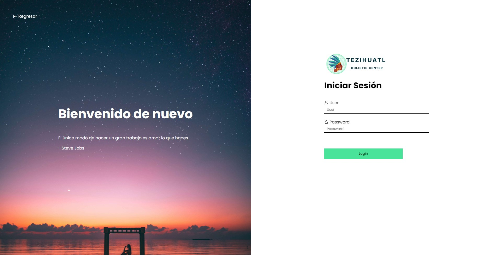
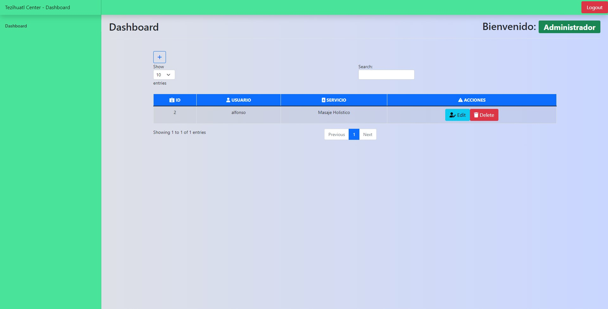

# Backend de Tezihuatl Holistic Center :hospital:

## Iniciar proyecto :rocket:

---

1.- Primero debes clonar este repositorio en tu entorno local pero antes recuerda tener instalado node para poder ejecutarlo y en caso de no tenerlo lo puedes descargar del siguiente [enlace](https://nodejs.org/es/).

para verificar que lo tienes instalado ejecuta el siguiente comando en tu terminal.

```bash
    node -v
```

con el siguiente comando puedes clonar este respositorio en tu entorno local
(recuerda tener instalado git o de lo contrario te marcará error al hacer el clone).

```bash
    git clone https://github.com/JosafatJimenezB/Tezihuatl_Backend.git
```

o en el boton verde que aparece en la parte superior derecha de la pantalla se seleccion descargar como zip y se descomprime en el explorador de archivos.

Despues de clonar el repositorio debes dirigirte a la carpeta donde esta el proyecto y ejecutar el siguiente comando:

```bash
    cd Tezihuatl_Backend
```

2.- Teniendo el paso anterior hay que instalar las dependencias de node para ejecutar el proyecto de forma local (verifica estar en la carpeta del proyecto):

```bash
    npm install
```

3.- Importa la base de datos a phpMyAdmin

Para ello lo primero es importar la base de datos en tu servidor sql o phpmyadmin.

con esto ya tendremos la base de datos operativa con las siguientes tablas:

**Clients**
En esta tabla es donde se guardaran los datos de los clientes que se registran en el sistema.

```sql
    CREATE TABLE `clients` (
      `id` int(11) NOT NULL,
      `user` varchar(150) NOT NULL,
      `rol` varchar(50) NOT NULL,
      `edad` int(3) NOT NULL,
      `genero` varchar(30) NOT NULL,
      `estadoCivil` varchar(50) NOT NULL,
      `domicilio` varchar(400) NOT NULL,
      `motivo` varchar(1000) NOT NULL
    )
```

**users**
En esta tabla se van guardando los usuarios que acceden al sistema.

```sql
    CREATE TABLE `users` (
      `id` int(11) NOT NULL,
      `user` varchar(50) NOT NULL,
      `name` varchar(100) NOT NULL,
      `pass` varchar(255) NOT NULL
    ) ENGINE=InnoDB DEFAULT CHARSET=utf8mb4;
```

4.- Ejecuta el siguiente comando en la terminal para ejecutar el servidor

```bash
    npm run app.js
```

o con el siguiente comando de nodemon para autorefrescar el servidor al hacer cambios

```bash
    nodemon start
```

5.- Una vez que el servidor esté corriendo debes ingresar al siguiente enlace para verificar que el servidor esta corriendo:

**http://localhost:5000**

## Funcionamiento del servidor :desktop_computer:

---

En el archivo principal **app.js** se importa el framework de express con el siguiente comando:

```js
const express = require("express");
const app = express();
```

y despues se ejecuta el servidor con el siguiente comando:

```js
const server = app.listen(process.env.PORT || port, () => {
  const port = server.address().port;
  console.log(`Express is working on port ${port}`);
});
```

con ello ya tendremos nuestro servidor corriendo en el puerto 5000.

pero ademas de ello tambien tenemos que importar a la libreria de cookie-parser para poder usar las cookies en el servidor y poder tener control sobre las sesiones y tambien agregamos dotenv para poder manejar variables de entorno.

## Vistas del proyecto :camera:

---





<br>

## License

---

- Puedes usar este proyecto para generar tu propio proyecto, pero debes dejar una referencia de donde lo obtuviste.

- No puedes usar las imagenes y los logos de este proyecto para tu proyecto.

- No olvides dejar una estrellita si te gusto :)

<br>

###### Made with :heart: by Josafat Jimenez :mexico:
